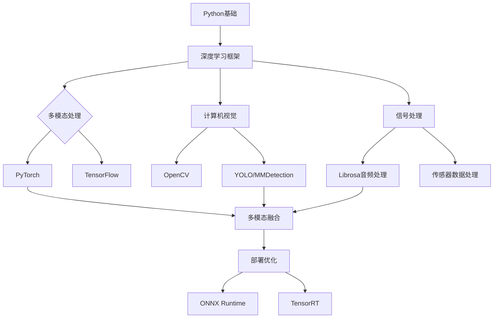

---
{"dg-publish":true,"permalink":"////","tags":["项目指导","暑期规划","机器人","多模态感知","软件著作权"]}
---

# 张开博 - 暑期学习科研规划

## 项目信息

**项目名称**: 《基于多模态感知的笼养家禽巡检机器人》

**核心任务**:
- [ ] 撰写优秀申报书
- [ ] 学习基础知识并阅读文献
- [ ] 动手实践并完成软件著作权申请

---

## 项目概览

> [!abstract] 项目简介
> 本项目旨在开发一款基于多模态感知技术的笼养家禽巡检机器人,通过融合视觉、听觉、温湿度等多种传感器数据,实现家禽健康状态的智能监测与异常预警。

> [!tip] 核心技术亮点
> - **多模态数据融合**: 视觉、听觉、环境传感数据的联合处理
> - **边缘计算**: 机器人端实时推理与决策
> - **智能巡检路径规划**: 基于禽舍环境的自主导航

---

## 阶段一: 文献调研与基础知识学习 (第1-3周)

### 1.1 多模态感知基础

#### 必读文献推荐

> [!note] 经典论文
> 1. **"Multimodal Learning: A Survey and Taxonomy"** - IEEE TPAMI 2023
>    - 关键词: 多模态融合策略、注意力机制
>
> 2. **"Sensor Fusion for Autonomous Robotics: A Comprehensive Survey"** - arXiv 2024
>    - 关键词: 传感器标定、数据对齐、融合算法
>
> 3. **"Edge AI for Robotics: Challenges and Opportunities"** - Nature Machine Intelligence 2023
>    - 关键词: 边缘推理、模型压缩、实时性优化

#### 技术栈学习路径



#### 推荐学习资源

> [!example] 在线课程
> - **Stanford CS231N**: 计算机视觉
> - **DeepLearning.ai**: Sequence Models (音频处理)
> - **NVIDIA Jetson AI**: 边缘部署实战

### 1.2 机器人技术基础

#### 关键技术点

- **SLAM (同步定位与地图构建)**
  - 推荐: **ORB-SLAM3**、**Cartographer**
  - 文献: "ORB-SLAM3: An Accurate Open-Source Library for Visual, Visual-Inertial and Multi-Map SLAM"

- **路径规划算法**
  - A*、Dijkstra、RRT*
  - ROS Navigation Stack

- **传感器集成**
  - 摄像头 (RGB-D相机)
  - IMU (惯性测量单元)
  - 温湿度传感器
  - 麦克风阵列

### 1.3 学习任务清单

- [ ] **Week 1**: 完成上述3篇核心论文的精读,撰写文献综述笔记
- [ ] **Week 2**: 学习 PyTorch/TensorFlow 基础,完成 MNIST 多模态分类实战
- [ ] **Week 3**: 搭建机器人仿真环境 (Gazebo/PyBullet),理解传感器数据流

---

## 阶段二: 优秀申报书撰写 (第4-5周)

### 2.1 申报书结构框架

> [!important] 标准申报书结构
> 1. **立项依据** (20%)
>    - 研究背景与意义
>    - 国内外研究现状
>    - 存在的科学问题
>    - 本项目的创新点
>
> 2. **研究内容与目标** (25%)
>    - 研究目标 (明确、可量化)
>    - 主要研究内容 (3-5个)
>    - 拟解决的关键科学问题
>    - 技术路线图
>
> 3. **研究方案** (30%)
>    - 总体技术路线
>    - 详细实验设计
>    - 数据采集方案
>    - 评价指标体系
>
> 4. **研究基础与条件** (15%)
>    - 前期工作基础
>    - 团队优势
>    - 实验条件
>
> 5. **进度安排** (10%)
>    - 甘特图或里程碑计划

### 2.2 本项目申报要点

#### 创新点提炼

> [!tip] 三大创新点
> 1. **多模态异构数据深度融合**
>    - 提出基于交叉注意力机制的视觉-听觉-环境数据融合算法
>    - 解决单一模态在复杂禽舍环境下鲁棒性不足的问题
>
> 2. **轻量化边缘推理模型**
>    - 设计知识蒸馏+模型剪枝的压缩方案
>    - 实现Jetson平台实时推理 (FPS > 25)
>
> 3. **自适应巡检策略**
>    - 基于强化学习的动态路径规划
>    - 根据家禽活动规律优化巡检效率

#### 技术路线图


### 2.3 撰写技巧

> [!warning] 常见错误
> - ❌ 创新点过于宽泛,缺乏具体技术细节
> - ❌ 技术路线图与实际实施脱节
> - ❌ 缺乏可量化的评价指标
> - ❌ 文献综述只罗列不分析

> [!success] 优秀申报书特征
> - ✅ **问题导向**: 明确要解决什么科学/工程问题
> - ✅ **逻辑清晰**: 技术路线环环相扣
> - ✅ **数据支撑**: 用具体数字说话 (如"准确率提升15%")
> - ✅ **图文并茂**: 流程图、架构图、甘特图齐全

### 2.4 申报书撰写任务

- [ ] **Week 4**: 完成文献综述和立项依据部分
- [ ] **Week 5**: 绘制技术路线图,完成研究方案设计
- [ ] **Week 5**: 导师审核并修改完善

---

## 阶段三: 实践开发 (第6-9周)

### 3.1 系统架构设计

#### 硬件选型建议

| 组件 | 推荐型号 | 理由 |
|------|----------|------|
| 计算平台 | NVIDIA Jetson Nano/Xavier | 边缘AI推理能力强 |
| 摄像头 | Intel RealSense D435i | RGB-D,内置IMU |
| 麦克风 | ReSpeaker Mic Array v2.0 | 多麦克风阵列,支持DOA |
| 移动底盘 | TurtleBot3 或自研轮式底盘 | ROS生态成熟 |
| 传感器 | DHT22温湿度、MQ系列气体传感器 | 低成本,精度满足需求 |

#### 软件架构

```
巡检机器人系统
├── 感知层
│   ├── 视觉模块 (YOLOv8/SegFormer)
│   ├── 音频模块 (VAD + 分类)
│   └── 环境传感模块 (数据融合)
├── 融合层
│   ├── 多模态特征融合
│   ├── 时序建模 (LSTM/Transformer)
│   └── 异常检测算法
├── 决策层
│   ├── 健康状态评估
│   ├── 巡检路径规划
│   └── 预警系统
└── 应用层
    ├── Web监控界面
    ├── 数据管理
    └── 远程控制
```

### 3.2 核心功能实现

#### 3.2.1 视觉检测模块

```python
# 示例: YOLOv8多目标检测
from ultralytics import YOLO

class PoultryDetector:
    def __init__(self, model_path):
        self.model = YOLO(model_path)

    def detect(self, image):
        """
        检测家禽数量、位置、异常行为
        返回: 检测框、置信度、类别标签
        """
        results = self.model(image)
        return self.parse_results(results)

    def parse_results(self, results):
        # 解析检测结果
        # 提取: 家禽数量、位置分布、异常姿态
        pass
```

#### 3.2.2 多模态融合模块

```python
# 示例: 基于注意力机制的融合
import torch
import torch.nn as nn

class MultiModalFusion(nn.Module):
    def __init__(self, visual_dim, audio_dim, sensor_dim, hidden_dim):
        super().__init__()
        self.visual_proj = nn.Linear(visual_dim, hidden_dim)
        self.audio_proj = nn.Linear(audio_dim, hidden_dim)
        self.sensor_proj = nn.Linear(sensor_dim, hidden_dim)

        self.cross_attention = nn.MultiheadAttention(
            embed_dim=hidden_dim,
            num_heads=8
        )

        self.classifier = nn.Sequential(
            nn.Linear(hidden_dim, 128),
            nn.ReLU(),
            nn.Dropout(0.3),
            nn.Linear(128, 3)  # 正常/异常/紧急
        )

    def forward(self, visual_feat, audio_feat, sensor_feat):
        # 投影到统一空间
        v = self.visual_proj(visual_feat)
        a = self.audio_proj(audio_feat)
        s = self.sensor_proj(sensor_feat)

        # 拼接作为Query-Key-Value
        features = torch.stack([v, a, s], dim=1)
        fused, _ = self.cross_attention(features, features, features)

        # 全局池化
        fused = fused.mean(dim=1)

        # 分类
        output = self.classifier(fused)
        return output
```

#### 3.2.3 巡检路径规划

```python
# 示例: 基于覆盖率的路径规划
import numpy as np

class CoveragePathPlanner:
    def __init__(self, map_size, robot_radius):
        self.map_size = map_size
        self.robot_radius = robot_radius

    def generate_path(self, obstacles, start_pose):
        """
        生成全覆盖巡检路径
        使用牛耕式路径 (Boustrophedon)
        """
        path = []

        # 简化版: 生成平行扫描路径
        x = start_pose[0]
        y = start_pose[1]
        direction = 1  # 1: 正向, -1: 反向

        while y < self.map_size[1]:
            # X方向扫描
            path.append((x, y))

            if direction == 1:
                x = self.map_size[0] - self.robot_radius
            else:
                x = self.robot_radius

            # Y方向步进
            y += 2 * self.robot_radius
            direction *= -1

        return np.array(path)
```

### 3.3 开发任务清单

- [ ] **Week 6**: 搭建开发环境,完成数据采集脚本
- [ ] **Week 7**: 实现视觉检测模块 (目标检测+行为识别)
- [ ] **Week 8**: 实现多模态融合算法,完成健康状态评估
- [ ] **Week 9**: 集成各模块,完成端到端测试

---

## 阶段四: 软件著作权申请准备 (第10-12周)

### 4.1 软著申请要点

> [!important] 软著核心材料
> 1. **源代码文档** (前30页+后30页,共60页)
>    - 每页不少于50行
>    - 需有完整的注释
>    - 代码量不少于3000行
>
> 2. **软件使用说明书** (图文并茂)
>    - 系统架构图
>    - 功能模块说明
>    - 操作步骤截图
>    - 核心算法流程图
>
> 3. **申请表**
>    - 软件名称、版本号
>    - 开发完成日期、首次发表日期
>    - 著作权人信息

### 4.2 代码规范要求

#### 命名规范

```python
# 文件名: poultry_inspection_bot/detector.py
# 模块: 视觉检测模块

"""
笼养家禽巡检机器人 - 视觉检测模块

功能:
    - 基于YOLOv8的家禽目标检测
    - 异常行为识别 (发病、受伤、争斗)
    - 数据统计与分析

作者: 张开博
日期: 2026-07-15
版本: v1.0.0
"""

import cv2
import numpy as np
from typing import List, Dict, Tuple
import logging

# 配置日志
logging.basicConfig(
    level=logging.INFO,
    format='%(asctime)s - %(name)s - %(levelname)s - %(message)s'
)
logger = logging.getLogger(__name__)


class VisualDetector:
    """
    视觉检测器类

    Attributes:
        model_path (str): 模型权重路径
        confidence_threshold (float): 检测置信度阈值
        device (str): 运行设备 (cuda/cpu)
    """

    def __init__(self, model_path: str, confidence_threshold: float = 0.5):
        """
        初始化检测器

        Args:
            model_path (str): 预训练模型路径
            confidence_threshold (float): 置信度阈值,默认0.5
        """
        self.model_path = model_path
        self.confidence_threshold = confidence_threshold
        self.device = "cuda" if torch.cuda.is_available() else "cpu"

        logger.info(f"加载模型: {model_path}")
        self._load_model()

    def _load_model(self):
        """加载预训练模型"""
        # TODO: 实现模型加载逻辑
        pass

    def detect(self, image: np.ndarray) -> List[Dict]:
        """
        执行目标检测

        Args:
            image (np.ndarray): 输入图像 (BGR格式)

        Returns:
            List[Dict]: 检测结果列表
                [{
                    "bbox": [x, y, w, h],
                    "confidence": 0.95,
                    "class": "poultry",
                    "behavior": "normal"
                }]
        """
        # TODO: 实现检测逻辑
        pass

    def analyze_behavior(self, tracklets: List) -> Dict:
        """
        分析家禽行为模式

        Args:
            tracklets (List): 目标跟踪序列

        Returns:
            Dict: 行为分析结果
        """
        # TODO: 实现行为分析逻辑
        pass
```

### 4.3 说明书撰写模板

#### 目录结构

```markdown
# 笼养家禽巡检机器人软件 V1.0 使用说明书

## 1. 软件概述
### 1.1 软件简介
### 1.2 主要功能
### 1.3 运行环境

## 2. 系统架构
### 2.1 总体架构图
### 2.2 功能模块划分

## 3. 安装与部署
### 3.1 硬件要求
### 3.2 软件依赖
### 3.3 安装步骤 (配截图)

## 4. 功能使用说明
### 4.1 系统启动
### 4.2 实时监控功能
### 4.3 异常预警功能
### 4.4 历史数据查询

## 5. 核心算法说明
### 5.1 多模态融合算法流程图
### 5.2 路径规划算法原理

## 6. 常见问题解答
### 6.1 安装问题
### 6.2 使用问题
### 6.3 性能优化建议

## 7. 附录
### 7.1 技术参数表
### 7.2 API接口文档
```

### 4.4 软著申请任务清单

- [ ] **Week 10**: 整理源代码,确保代码规范和注释完整
- [ ] **Week 11**: 撰写软件使用说明书,制作操作截图和流程图
- [ ] **Week 12**: 填写申请表,准备申请材料,提交申请

---

## 学习资源汇总

### 书籍推荐

1. **《多模态机器学习》** - 孙仕亮等
2. **《机器人学导论》** - Craig JJ
3. **《深度学习实战: PyTorch》** - 小微

### 在线资源

- **Papers with Codes**: https://paperswithcode.com/
- **ROS 官方教程**: http://wiki.ros.org/
- **NVIDIA Jetson 项目**: https://developer.nvidia.com/embedded/jetson-projects

### 工具软件

- **文献管理**: Zotero
- **代码编辑**: VS Code
- **实验记录**: Jupyter Lab
- **版本控制**: Git/GitHub

---

## 进度跟踪表

| 阶段 | 任务 | 预计完成时间 | 实际完成时间 | 状态 | 备注 |
|------|------|--------------|--------------|------|------|
| 1 | 文献调研 | Week 3 | | ⏳ | |
| 2 | 申报书撰写 | Week 5 | | ⏳ | |
| 3 | 系统开发 | Week 9 | | ⏳ | |
| 4 | 软著申请 | Week 12 | | ⏳ | |

---

## 常见问题 FAQ

> [!faq] Q1: 多模态数据如何同步?
> A: 建议使用硬件触发同步或软件时间戳对齐。具体方案:
> - 视觉和音频: 统一采集频率,打上UTC时间戳
> - 传感器数据: 使用ROS bag记录,后续离线对齐

> [!faq] Q2: 边缘设备推理速度太慢怎么办?
> A: 优化策略:
> - 模型量化 (FP16/INT8)
> - 模型剪枝 (移除冗余通道)
> - 使用TensorRT加速部署
> - 降低输入分辨率

> [!faq] Q3: 如何获取训练数据?
> A: 数据获取途径:
> - 公开数据集: PoultryDataset (如适用)
> - 自行采集: 使用机器人实地录制
> - 数据增强: 旋转、翻转、加噪声

---

## 导师联系安排

> [!tip] 定期汇报机制
> - **双周组会**: 汇报学习进度和遇到的问题
> - **月度总结**: 提交阶段总结报告
> - **即时沟通**: 重大问题及时邮件/微信沟通

---

## 参考文献管理

建议使用 Zotero 管理文献,分类标签:
- `#多模态融合`
- `#机器人巡检`
- `#家禽监测`
- `#边缘计算`

---

**最后更新**: 2026-01-22
**文档版本**: v1.0
**创建人**: Claude Code Assistant
